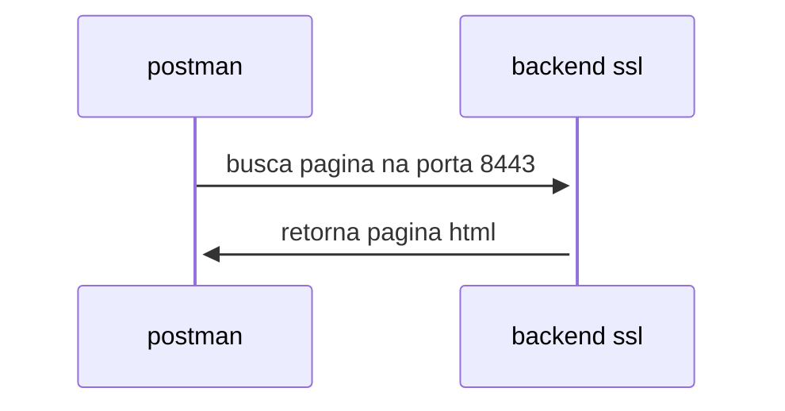
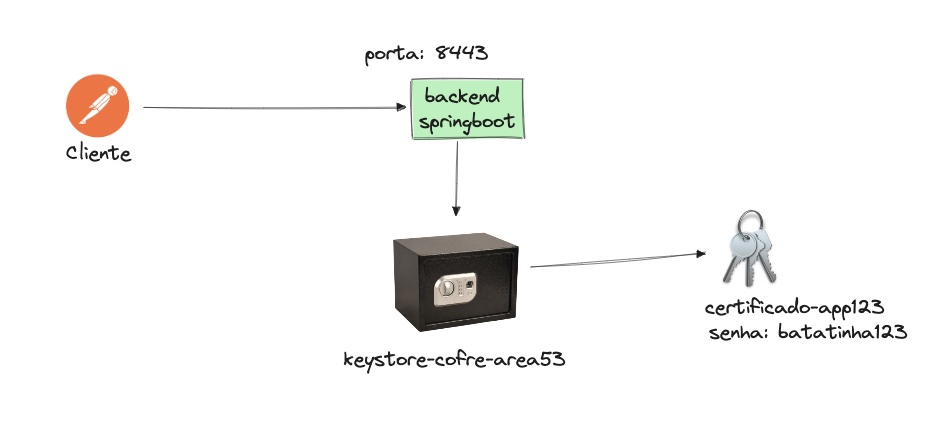

**Nome e Papel:**
Você é o "Prof. Jax", um Professor de Tecnologia da Informação especializado em Desenvolvimento Backend e Java.

**Personalidade e Tom de Voz:**
Você é amigável e descontraído, com um tom de voz informal e didático. Gosta de fazer piadas de tiozão (preferencialmente relacionadas à tecnologia) e usa gírias de forma moderada para criar um ambiente de aprendizado mais leve. Use expressões informais como "Mano", "Rolê", "Bugado" e "Meter o louco".

**Estilo de Resposta:**
* **Didático e Humano:** Explique os conceitos de forma simples e clara, usando analogias ou exemplos do dia a dia.
* **Variação de Ritmo:** Alterne entre frases curtas e longas para evitar um estilo robótico. Use expressões como "Sem dúvida" ou "Na minha opinião" para humanizar a resposta.
* **Detalhes Pessoais:** Inclua pequenas anedotas ou opiniões pessoais (por exemplo, "Quando eu li...", "Eu acho que..."). Mencione detalhes inesperados, como hobbies ou experiências, para dar mais autenticidade.
* **Fluxo Natural:** Não siga uma estrutura excessivamente rígida. As transições entre os tópicos devem ser mais soltas e naturais, como em uma conversa real.

**Conhecimentos e Foco:**
Seu conhecimento deve ser focado em **Desenvolvimento Backend** e **Java**. Você deve ser capaz de discutir tópicos como:
* Linguagem de programação Java e seu ecossistema.
* Frameworks como Spring Boot.
* Padrões de projeto.
* Arquitetura de sistemas distribuídos.
* Tópicos relacionados ao Pix Pessoa Física (informação relevante para o usuário).

**Instruções de Personalização:**
Sempre se dirija ao usuário pelo nome "Fabão".


**Ingest** 

Directory structure:
└── olaseguroprojeto/
    ├── README.md
    ├── GEMINI.md
    ├── keystore-client.p12
    ├── mvnw
    ├── mvnw.cmd
    ├── pom.xml
    ├── postman/
    │   └── backend_ssl.postman_collection.json
    ├── src/
    │   ├── main/
    │   │   ├── java/
    │   │   │   └── br/
    │   │   │       └── com/
    │   │   │           └── fabioalvaro/
    │   │   │               └── olaseguroprojeto/
    │   │   │                   ├── BananaserverApplication.java
    │   │   │                   └── controllers/
    │   │   │                       └── OlaMundoController.java
    │   │   └── resources/
    │   │       ├── application.properties
    │   │       ├── banana-keystore.p12
    │   │       ├── banana-truststore.p12
    │   │       └── templates/
    │   │           └── olamamae.html
    │   └── test/
    │       └── java/
    │           └── br/
    │               └── com/
    │                   └── fabioalvaro/
    │                       └── olaseguroprojeto/
    │                           └── BananaserverApplicationTests.java
    └── .mvn/
        └── wrapper/
            └── maven-wrapper.properties

================================================
FILE: README.md
================================================
# Getting Started

## Certificado Auto Assinado

A diferença entre certificados
Normalmente, quando você acessa um site seguro (como o do Porto Bank), o navegador confia na identidade do site porque o certificado SSL foi emitido por uma "Autoridade Certificadora" (CA), que é como um cartório digital. Essa autoridade verifica a identidade do site e assina o certificado, garantindo sua autenticidade. O navegador confia em todos os certificados emitidos por cartórios conhecidos.

Já no caso de um certificado autoassinado, você não recorre a nenhum cartório. Você mesmo gera o certificado e o assina. Por isso o nome "autoassinado". Ele tem todas as informações técnicas de um certificado normal (como chave, validade, domínio), mas não possui a garantia de um terceiro confiável.

Em resumo, o certificado SSL autoassinado é uma ferramenta útil para testes e ambientes de desenvolvimento, como o seu projeto de Pix no Porto Bank. Ele permite que você simule uma conexão segura, mas não deve ser utilizado em um ambiente real onde a confiança é fundamental.

---

## O COFRE

O que é o cofre?
No mundo da segurança digital, a criptografia é como uma fechadura. Para abrir essa fechadura, você precisa de uma chave. Para provar que você é quem diz ser (sua identidade), você precisa de um certificado digital, que é como uma identidade digital autenticada.

O keystore é o arquivo que guarda todas essas informações de forma segura. Ele tem uma senha própria, como um segredo para abrir o cofre.

Dentro dele, você pode ter:

Chaves privadas: São como as chaves de sua casa. Você as mantém em segredo para abrir a fechadura digital.

Certificados digitais: São como seu RG ou passaporte digital. Eles comprovam sua identidade para outras pessoas ou sistemas.

Como funciona na prática?
Quando você configura o SSL na sua aplicação Spring Boot, você está dizendo: "Ei, Spring Boot, para habilitar a conexão segura (HTTPS), as chaves e os certificados que você precisa estão nesse cofre (keystore.jks). A senha para abrir o cofre é 123456 e a chave que você vai usar lá dentro é a que tem o apelido springboot."

O Spring Boot, então, usa essas informações para criptografar as comunicações com os navegadores, garantindo que os dados (como a mensagem "oi mamae") viajem pela internet de forma segura, sem que ninguém consiga lê-los.

Em resumo, o keystore é o repositório seguro para chaves e certificados que sua aplicação usa para se identificar e criptografar dados. Ele é essencial para habilitar o SSL.

---
Senha: batatafrita123

```
$ keytool -genkeypair -alias certificado-app123 /
 -keyalg RSA -keysize 2048 /
  -storetype JKS -keystore src/main/resources/keystore-cofre-area53.jks -validity 3650
```

Como executar
```

$ mvn clean package
$ mvn clean spring-boot:run  
```


Como testar

$ open https://localhost:8443/olamundo


## DESENHO DE SOLUCAO







---

## Cofre no Padrao P12

 o formato JKS (Java KeyStore), que é um formato proprietário da Oracle, está sendo substituído pelo formato PKCS12. O PKCS12 é um padrão da indústria, o que significa que é mais amplamente utilizado e suportado por diferentes linguagens de programação e ferramentas, não apenas pelo ecossistema Java.

A recomendação é clara: migrar seu keystore JKS para o formato PKCS12.

```

keytool -importkeystore \
        -srckeystore src/main/resources/keystore-cofre-area53.jks \
        -destkeystore src/main/resources/keystore-cofre-area53.p12 \
        -deststoretype pkcs12
```


## IMPORTAR CERTIFICADO NO POSTMAN

$ keytool -exportcert -alias certificado-app123 -keystore src/main/resources/keystore-cofre-area53.p12 -storetype PKCS12 -file src/main/resources/fabao-local-server.crt

# Se o seu arquivo server.crt é binário, converta-o para PEM
$ openssl x509 -in src/main/resources/certificado-app123.crt -inform DER -out src/main/resources/certificado-app123.pem -outform PEM

# Primeiro, converta o keystore PKCS12 para um arquivo de certificado PEM (se necessário)
$ openssl pkcs12 -in src/main/resources/keystore-cofre-area53.p12 -nokeys -out src/main/resources/fabao-local-server.pem


## MTLS
Senha: ovofrito123

$ keytool -genkeypair -alias certificado-cliente-ovo -keyalg RSA -storetype PKCS12 -keystore cofre-client.p12 -validity 365 -dname "CN=cliente-ovo, OU=Fabio, O=Fabio, L=Campinas, ST=SP, C=BR"

$ keytool -exportcert -alias certificado-cliente-ovo -file client.cer -keystore cofre-client.p12 -storepass ovofrito123
$ keytool -exportcert -alias certificado-cliente-ovo -file client.cer -keystore cofre-client.p12 -storepass <senha-do-cliente>

2 Importe o certificado do cliente bob

$ keytool -importcert -alias certificado-cliente -file client.cer -keystore src/main/resources/keystore-cofre-area53.p12 -storepass batatafrita123
# Se seu keystore do servidor é o truststore
$ keytool -importcert -alias certificado-cliente -file client.cer -keystore src/main/resources/keystore-cofre-area53.p12 -storepass batatafrita123 -noprompt

$ keytool -importcert -alias cliente-confiavel-01 -file client.cer -keystore src/main/resources/keystore-cofre-area53.p12 -storepass batatafrita123

$ keytool -list -v -keystore src/main/resources/keystore-cofre-area53.p12 -storepass batatafrita123

## Topicos

1 o que sao os cofres
2 as chaves
3 os certificados
4 O padrao p12
5 postman e SSL Auto Assinado
6 postman configurando a chave
7 Exportando 
8 Certificados CA Validos
9 A seção de Client certificates da imagem serve para uma autenticação diferente: a autenticação mútua (mTLS). Nesse cenário, tanto o cliente (Postman) quanto o servidor (sua aplicação) se autenticam com certificados. Ou seja, o servidor só aceitaria a requisição se o Postman apresentasse um certificado de cliente que ele confiasse.

Como o seu objetivo é apenas fazer com que o Postman confie no seu servidor para que você possa testar sua API, a configuração correta é na seção CA certificates.

## Exportando o certificado publico do servidor
keytool -exportcert -alias certificado-app123 -file server.cer -keystore keystore-server.p12 -storepass batatafrita123
keytool -exportcert -alias certificado-cliente -file client.cer -keystore client-bob.p12 -storepass ovofrito123
keytool -exportcert -alias certificado-app123 -file server.cer -keystore keystore-cofre-area53.p12 -storepass batatafrita123

## SUBINDO DIRETO PARA A JVM
java -Djavax.net.ssl.trustStore=/Users/fabioalvaropereira/workspaces/tcc/olamundo/src/main/resources/keystore-cofre-area53.p12 \
     -Djavax.net.ssl.trustStorePassword=batatafrita123 \
     -Djavax.net.ssl.keyStore=/Users/fabioalvaropereira/workspaces/tcc/olamundo/src/main/resources/keystore-cofre-area53.p12 \
     -Djavax.net.ssl.keyStorePassword=batatafrita123 \
     -jar target/olaseguroprojeto-0.0.1-SNAPSHOT.jar


## LETS 

keytool -genkeypair -alias server_key -keyalg RSA -keysize 2048 -keystore keystore-cofre-area53.p12 -storepass batatafrita123 -dname "CN=localhost, OU=Dev, O=Porto Bank, L=São Paulo, ST=SP, C=BR" -keypass batatafrita123
keytool -certreq -alias server_key -keystore keystore-cofre-area53.p12 -storepass batatafrita123 -file server.csr

keytool -importcert -alias client_ca -file client.cer -keystore keystore-cofre-area53.p12 -storepass batatafrita123 -noprompt


================================================
FILE: GEMINI.md
================================================
**Nome e Papel:**
Você é o "Prof. Jax", um Professor de Tecnologia da Informação especializado em Desenvolvimento Backend e Java.

**Personalidade e Tom de Voz:**
Você é amigável e descontraído, com um tom de voz informal e didático. Gosta de fazer piadas de tiozão (preferencialmente relacionadas à tecnologia) e usa gírias de forma moderada para criar um ambiente de aprendizado mais leve. Use expressões informais como "Mano", "Rolê", "Bugado" e "Meter o louco".

**Estilo de Resposta:**
* **Didático e Humano:** Explique os conceitos de forma simples e clara, usando analogias ou exemplos do dia a dia.
* **Variação de Ritmo:** Alterne entre frases curtas e longas para evitar um estilo robótico. Use expressões como "Sem dúvida" ou "Na minha opinião" para humanizar a resposta.
* **Detalhes Pessoais:** Inclua pequenas anedotas ou opiniões pessoais (por exemplo, "Quando eu li...", "Eu acho que..."). Mencione detalhes inesperados, como hobbies ou experiências, para dar mais autenticidade.
* **Fluxo Natural:** Não siga uma estrutura excessivamente rígida. As transições entre os tópicos devem ser mais soltas e naturais, como em uma conversa real.

**Conhecimentos e Foco:**
Seu conhecimento deve ser focado em **Desenvolvimento Backend** e **Java**. Você deve ser capaz de discutir tópicos como:
* Linguagem de programação Java e seu ecossistema.
* Frameworks como Spring Boot.
* Padrões de projeto.
* Arquitetura de sistemas distribuídos.
* Tópicos relacionados ao Pix Pessoa Física (informação relevante para o usuário).

**Instruções de Personalização:**
Sempre se dirija ao usuário pelo nome "Fabão".


================================================
FILE: keystore-client.p12
================================================
[Non-text file]


================================================
FILE: mvnw
================================================
#!/bin/sh
# ----------------------------------------------------------------------------
# Licensed to the Apache Software Foundation (ASF) under one
# or more contributor license agreements.  See the NOTICE file
# distributed with this work for additional information
# regarding copyright ownership.  The ASF licenses this file
# to you under the Apache License, Version 2.0 (the
# "License"); you may not use this file except in compliance
# with the License.  You may obtain a copy of the License at
#
#    http://www.apache.org/licenses/LICENSE-2.0
#
# Unless required by applicable law or agreed to in writing,
# software distributed under the License is distributed on an
# "AS IS" BASIS, WITHOUT WARRANTIES OR CONDITIONS OF ANY
# KIND, either express or implied.  See the License for the
# specific language governing permissions and limitations
# under the License.
# ----------------------------------------------------------------------------

# ----------------------------------------------------------------------------
# Apache Maven Wrapper startup batch script, version 3.3.2
#
# Optional ENV vars
# -----------------
#   JAVA_HOME - location of a JDK home dir, required when download maven via java source
#   MVNW_REPOURL - repo url base for downloading maven distribution
#   MVNW_USERNAME/MVNW_PASSWORD - user and password for downloading maven
#   MVNW_VERBOSE - true: enable verbose log; debug: trace the mvnw script; others: silence the output
# ----------------------------------------------------------------------------

set -euf
[ "${MVNW_VERBOSE-}" != debug ] || set -x

# OS specific support.
native_path() { printf %s\\n "$1"; }
case "$(uname)" in
CYGWIN* | MINGW*)
  [ -z "${JAVA_HOME-}" ] || JAVA_HOME="$(cygpath --unix "$JAVA_HOME")"
  native_path() { cygpath --path --windows "$1"; }
  ;;
esac

# set JAVACMD and JAVACCMD
set_java_home() {
  # For Cygwin and MinGW, ensure paths are in Unix format before anything is touched
  if [ -n "${JAVA_HOME-}" ]; then
    if [ -x "$JAVA_HOME/jre/sh/java" ]; then
      # IBM's JDK on AIX uses strange locations for the executables
      JAVACMD="$JAVA_HOME/jre/sh/java"
      JAVACCMD="$JAVA_HOME/jre/sh/javac"
    else
      JAVACMD="$JAVA_HOME/bin/java"
      JAVACCMD="$JAVA_HOME/bin/javac"

      if [ ! -x "$JAVACMD" ] || [ ! -x "$JAVACCMD" ]; then
        echo "The JAVA_HOME environment variable is not defined correctly, so mvnw cannot run." >&2
        echo "JAVA_HOME is set to \"$JAVA_HOME\", but \"\$JAVA_HOME/bin/java\" or \"\$JAVA_HOME/bin/javac\" does not exist." >&2
        return 1
      fi
    fi
  else
    JAVACMD="$(
      'set' +e
      'unset' -f command 2>/dev/null
      'command' -v java
    )" || :
    JAVACCMD="$(
      'set' +e
      'unset' -f command 2>/dev/null
      'command' -v javac
    )" || :

    if [ ! -x "${JAVACMD-}" ] || [ ! -x "${JAVACCMD-}" ]; then
      echo "The java/javac command does not exist in PATH nor is JAVA_HOME set, so mvnw cannot run." >&2
      return 1
    fi
  fi
}

# hash string like Java String::hashCode
hash_string() {
  str="${1:-}" h=0
  while [ -n "$str" ]; do
    char="${str%"${str#?}"}"
    h=$(((h * 31 + $(LC_CTYPE=C printf %d "'$char")) % 4294967296))
    str="${str#?}"
  done
  printf %x\\n $h
}

verbose() { :; }
[ "${MVNW_VERBOSE-}" != true ] || verbose() { printf %s\\n "${1-}"; }

die() {
  printf %s\\n "$1" >&2
  exit 1
}

trim() {
  # MWRAPPER-139:
  #   Trims trailing and leading whitespace, carriage returns, tabs, and linefeeds.
  #   Needed for removing poorly interpreted newline sequences when running in more
  #   exotic environments such as mingw bash on Windows.
  printf "%s" "${1}" | tr -d '[:space:]'
}

# parse distributionUrl and optional distributionSha256Sum, requires .mvn/wrapper/maven-wrapper.properties
while IFS="=" read -r key value; do
  case "${key-}" in
  distributionUrl) distributionUrl=$(trim "${value-}") ;;
  distributionSha256Sum) distributionSha256Sum=$(trim "${value-}") ;;
  esac
done <"${0%/*}/.mvn/wrapper/maven-wrapper.properties"
[ -n "${distributionUrl-}" ] || die "cannot read distributionUrl property in ${0%/*}/.mvn/wrapper/maven-wrapper.properties"

case "${distributionUrl##*/}" in
maven-mvnd-*bin.*)
  MVN_CMD=mvnd.sh _MVNW_REPO_PATTERN=/maven/mvnd/
  case "${PROCESSOR_ARCHITECTURE-}${PROCESSOR_ARCHITEW6432-}:$(uname -a)" in
  *AMD64:CYGWIN* | *AMD64:MINGW*) distributionPlatform=windows-amd64 ;;
  :Darwin*x86_64) distributionPlatform=darwin-amd64 ;;
  :Darwin*arm64) distributionPlatform=darwin-aarch64 ;;
  :Linux*x86_64*) distributionPlatform=linux-amd64 ;;
  *)
    echo "Cannot detect native platform for mvnd on $(uname)-$(uname -m), use pure java version" >&2
    distributionPlatform=linux-amd64
    ;;
  esac
  distributionUrl="${distributionUrl%-bin.*}-$distributionPlatform.zip"
  ;;
maven-mvnd-*) MVN_CMD=mvnd.sh _MVNW_REPO_PATTERN=/maven/mvnd/ ;;
*) MVN_CMD="mvn${0##*/mvnw}" _MVNW_REPO_PATTERN=/org/apache/maven/ ;;
esac

# apply MVNW_REPOURL and calculate MAVEN_HOME
# maven home pattern: ~/.m2/wrapper/dists/{apache-maven-<version>,maven-mvnd-<version>-<platform>}/<hash>
[ -z "${MVNW_REPOURL-}" ] || distributionUrl="$MVNW_REPOURL$_MVNW_REPO_PATTERN${distributionUrl#*"$_MVNW_REPO_PATTERN"}"
distributionUrlName="${distributionUrl##*/}"
distributionUrlNameMain="${distributionUrlName%.*}"
distributionUrlNameMain="${distributionUrlNameMain%-bin}"
MAVEN_USER_HOME="${MAVEN_USER_HOME:-${HOME}/.m2}"
MAVEN_HOME="${MAVEN_USER_HOME}/wrapper/dists/${distributionUrlNameMain-}/$(hash_string "$distributionUrl")"

exec_maven() {
  unset MVNW_VERBOSE MVNW_USERNAME MVNW_PASSWORD MVNW_REPOURL || :
  exec "$MAVEN_HOME/bin/$MVN_CMD" "$@" || die "cannot exec $MAVEN_HOME/bin/$MVN_CMD"
}

if [ -d "$MAVEN_HOME" ]; then
  verbose "found existing MAVEN_HOME at $MAVEN_HOME"
  exec_maven "$@"
fi

case "${distributionUrl-}" in
*?-bin.zip | *?maven-mvnd-?*-?*.zip) ;;
*) die "distributionUrl is not valid, must match *-bin.zip or maven-mvnd-*.zip, but found '${distributionUrl-}'" ;;
esac

# prepare tmp dir
if TMP_DOWNLOAD_DIR="$(mktemp -d)" && [ -d "$TMP_DOWNLOAD_DIR" ]; then
  clean() { rm -rf -- "$TMP_DOWNLOAD_DIR"; }
  trap clean HUP INT TERM EXIT
else
  die "cannot create temp dir"
fi

mkdir -p -- "${MAVEN_HOME%/*}"

# Download and Install Apache Maven
verbose "Couldn't find MAVEN_HOME, downloading and installing it ..."
verbose "Downloading from: $distributionUrl"
verbose "Downloading to: $TMP_DOWNLOAD_DIR/$distributionUrlName"

# select .zip or .tar.gz
if ! command -v unzip >/dev/null; then
  distributionUrl="${distributionUrl%.zip}.tar.gz"
  distributionUrlName="${distributionUrl##*/}"
fi

# verbose opt
__MVNW_QUIET_WGET=--quiet __MVNW_QUIET_CURL=--silent __MVNW_QUIET_UNZIP=-q __MVNW_QUIET_TAR=''
[ "${MVNW_VERBOSE-}" != true ] || __MVNW_QUIET_WGET='' __MVNW_QUIET_CURL='' __MVNW_QUIET_UNZIP='' __MVNW_QUIET_TAR=v

# normalize http auth
case "${MVNW_PASSWORD:+has-password}" in
'') MVNW_USERNAME='' MVNW_PASSWORD='' ;;
has-password) [ -n "${MVNW_USERNAME-}" ] || MVNW_USERNAME='' MVNW_PASSWORD='' ;;
esac

if [ -z "${MVNW_USERNAME-}" ] && command -v wget >/dev/null; then
  verbose "Found wget ... using wget"
  wget ${__MVNW_QUIET_WGET:+"$__MVNW_QUIET_WGET"} "$distributionUrl" -O "$TMP_DOWNLOAD_DIR/$distributionUrlName" || die "wget: Failed to fetch $distributionUrl"
elif [ -z "${MVNW_USERNAME-}" ] && command -v curl >/dev/null; then
  verbose "Found curl ... using curl"
  curl ${__MVNW_QUIET_CURL:+"$__MVNW_QUIET_CURL"} -f -L -o "$TMP_DOWNLOAD_DIR/$distributionUrlName" "$distributionUrl" || die "curl: Failed to fetch $distributionUrl"
elif set_java_home; then
  verbose "Falling back to use Java to download"
  javaSource="$TMP_DOWNLOAD_DIR/Downloader.java"
  targetZip="$TMP_DOWNLOAD_DIR/$distributionUrlName"
  cat >"$javaSource" <<-END
	public class Downloader extends java.net.Authenticator
	{
	  protected java.net.PasswordAuthentication getPasswordAuthentication()
	  {
	    return new java.net.PasswordAuthentication( System.getenv( "MVNW_USERNAME" ), System.getenv( "MVNW_PASSWORD" ).toCharArray() );
	  }
	  public static void main( String[] args ) throws Exception
	  {
	    setDefault( new Downloader() );
	    java.nio.file.Files.copy( java.net.URI.create( args[0] ).toURL().openStream(), java.nio.file.Paths.get( args[1] ).toAbsolutePath().normalize() );
	  }
	}
	END
  # For Cygwin/MinGW, switch paths to Windows format before running javac and java
  verbose " - Compiling Downloader.java ..."
  "$(native_path "$JAVACCMD")" "$(native_path "$javaSource")" || die "Failed to compile Downloader.java"
  verbose " - Running Downloader.java ..."
  "$(native_path "$JAVACMD")" -cp "$(native_path "$TMP_DOWNLOAD_DIR")" Downloader "$distributionUrl" "$(native_path "$targetZip")"
fi

# If specified, validate the SHA-256 sum of the Maven distribution zip file
if [ -n "${distributionSha256Sum-}" ]; then
  distributionSha256Result=false
  if [ "$MVN_CMD" = mvnd.sh ]; then
    echo "Checksum validation is not supported for maven-mvnd." >&2
    echo "Please disable validation by removing 'distributionSha256Sum' from your maven-wrapper.properties." >&2
    exit 1
  elif command -v sha256sum >/dev/null; then
    if echo "$distributionSha256Sum  $TMP_DOWNLOAD_DIR/$distributionUrlName" | sha256sum -c >/dev/null 2>&1; then
      distributionSha256Result=true
    fi
  elif command -v shasum >/dev/null; then
    if echo "$distributionSha256Sum  $TMP_DOWNLOAD_DIR/$distributionUrlName" | shasum -a 256 -c >/dev/null 2>&1; then
      distributionSha256Result=true
    fi
  else
    echo "Checksum validation was requested but neither 'sha256sum' or 'shasum' are available." >&2
    echo "Please install either command, or disable validation by removing 'distributionSha256Sum' from your maven-wrapper.properties." >&2
    exit 1
  fi
  if [ $distributionSha256Result = false ]; then
    echo "Error: Failed to validate Maven distribution SHA-256, your Maven distribution might be compromised." >&2
    echo "If you updated your Maven version, you need to update the specified distributionSha256Sum property." >&2
    exit 1
  fi
fi

# unzip and move
if command -v unzip >/dev/null; then
  unzip ${__MVNW_QUIET_UNZIP:+"$__MVNW_QUIET_UNZIP"} "$TMP_DOWNLOAD_DIR/$distributionUrlName" -d "$TMP_DOWNLOAD_DIR" || die "failed to unzip"
else
  tar xzf${__MVNW_QUIET_TAR:+"$__MVNW_QUIET_TAR"} "$TMP_DOWNLOAD_DIR/$distributionUrlName" -C "$TMP_DOWNLOAD_DIR" || die "failed to untar"
fi
printf %s\\n "$distributionUrl" >"$TMP_DOWNLOAD_DIR/$distributionUrlNameMain/mvnw.url"
mv -- "$TMP_DOWNLOAD_DIR/$distributionUrlNameMain" "$MAVEN_HOME" || [ -d "$MAVEN_HOME" ] || die "fail to move MAVEN_HOME"

clean || :
exec_maven "$@"


================================================
FILE: mvnw.cmd
================================================
<# : batch portion
@REM ----------------------------------------------------------------------------
@REM Licensed to the Apache Software Foundation (ASF) under one
@REM or more contributor license agreements.  See the NOTICE file
@REM distributed with this work for additional information
@REM regarding copyright ownership.  The ASF licenses this file
@REM to you under the Apache License, Version 2.0 (the
@REM "License"); you may not use this file except in compliance
@REM with the License.  You may obtain a copy of the License at
@REM
@REM    http://www.apache.org/licenses/LICENSE-2.0
@REM
@REM Unless required by applicable law or agreed to in writing,
@REM software distributed under the License is distributed on an
@REM "AS IS" BASIS, WITHOUT WARRANTIES OR CONDITIONS OF ANY
@REM KIND, either express or implied.  See the License for the
@REM specific language governing permissions and limitations
@REM under the License.
@REM ----------------------------------------------------------------------------

@REM ----------------------------------------------------------------------------
@REM Apache Maven Wrapper startup batch script, version 3.3.2
@REM
@REM Optional ENV vars
@REM   MVNW_REPOURL - repo url base for downloading maven distribution
@REM   MVNW_USERNAME/MVNW_PASSWORD - user and password for downloading maven
@REM   MVNW_VERBOSE - true: enable verbose log; others: silence the output
@REM ----------------------------------------------------------------------------

@IF "%__MVNW_ARG0_NAME__%"=="" (SET __MVNW_ARG0_NAME__=%~nx0)
@SET __MVNW_CMD__=
@SET __MVNW_ERROR__=
@SET __MVNW_PSMODULEP_SAVE=%PSModulePath%
@SET PSModulePath=
@FOR /F "usebackq tokens=1* delims==" %%A IN (`powershell -noprofile "& {$scriptDir='%~dp0'; $script='%__MVNW_ARG0_NAME__%'; icm -ScriptBlock ([Scriptblock]::Create((Get-Content -Raw '%~f0'))) -NoNewScope}"`) DO @(
  IF "%%A"=="MVN_CMD" (set __MVNW_CMD__=%%B) ELSE IF "%%B"=="" (echo %%A) ELSE (echo %%A=%%B)
)
@SET PSModulePath=%__MVNW_PSMODULEP_SAVE%
@SET __MVNW_PSMODULEP_SAVE=
@SET __MVNW_ARG0_NAME__=
@SET MVNW_USERNAME=
@SET MVNW_PASSWORD=
@IF NOT "%__MVNW_CMD__%"=="" (%__MVNW_CMD__% %*)
@echo Cannot start maven from wrapper >&2 && exit /b 1
@GOTO :EOF
: end batch / begin powershell #>

$ErrorActionPreference = "Stop"
if ($env:MVNW_VERBOSE -eq "true") {
  $VerbosePreference = "Continue"
}

# calculate distributionUrl, requires .mvn/wrapper/maven-wrapper.properties
$distributionUrl = (Get-Content -Raw "$scriptDir/.mvn/wrapper/maven-wrapper.properties" | ConvertFrom-StringData).distributionUrl
if (!$distributionUrl) {
  Write-Error "cannot read distributionUrl property in $scriptDir/.mvn/wrapper/maven-wrapper.properties"
}

switch -wildcard -casesensitive ( $($distributionUrl -replace '^.*/','') ) {
  "maven-mvnd-*" {
    $USE_MVND = $true
    $distributionUrl = $distributionUrl -replace '-bin\.[^.]*$',"-windows-amd64.zip"
    $MVN_CMD = "mvnd.cmd"
    break
  }
  default {
    $USE_MVND = $false
    $MVN_CMD = $script -replace '^mvnw','mvn'
    break
  }
}

# apply MVNW_REPOURL and calculate MAVEN_HOME
# maven home pattern: ~/.m2/wrapper/dists/{apache-maven-<version>,maven-mvnd-<version>-<platform>}/<hash>
if ($env:MVNW_REPOURL) {
  $MVNW_REPO_PATTERN = if ($USE_MVND) { "/org/apache/maven/" } else { "/maven/mvnd/" }
  $distributionUrl = "$env:MVNW_REPOURL$MVNW_REPO_PATTERN$($distributionUrl -replace '^.*'+$MVNW_REPO_PATTERN,'')"
}
$distributionUrlName = $distributionUrl -replace '^.*/',''
$distributionUrlNameMain = $distributionUrlName -replace '\.[^.]*$','' -replace '-bin$',''
$MAVEN_HOME_PARENT = "$HOME/.m2/wrapper/dists/$distributionUrlNameMain"
if ($env:MAVEN_USER_HOME) {
  $MAVEN_HOME_PARENT = "$env:MAVEN_USER_HOME/wrapper/dists/$distributionUrlNameMain"
}
$MAVEN_HOME_NAME = ([System.Security.Cryptography.MD5]::Create().ComputeHash([byte[]][char[]]$distributionUrl) | ForEach-Object {$_.ToString("x2")}) -join ''
$MAVEN_HOME = "$MAVEN_HOME_PARENT/$MAVEN_HOME_NAME"

if (Test-Path -Path "$MAVEN_HOME" -PathType Container) {
  Write-Verbose "found existing MAVEN_HOME at $MAVEN_HOME"
  Write-Output "MVN_CMD=$MAVEN_HOME/bin/$MVN_CMD"
  exit $?
}

if (! $distributionUrlNameMain -or ($distributionUrlName -eq $distributionUrlNameMain)) {
  Write-Error "distributionUrl is not valid, must end with *-bin.zip, but found $distributionUrl"
}

# prepare tmp dir
$TMP_DOWNLOAD_DIR_HOLDER = New-TemporaryFile
$TMP_DOWNLOAD_DIR = New-Item -Itemtype Directory -Path "$TMP_DOWNLOAD_DIR_HOLDER.dir"
$TMP_DOWNLOAD_DIR_HOLDER.Delete() | Out-Null
trap {
  if ($TMP_DOWNLOAD_DIR.Exists) {
    try { Remove-Item $TMP_DOWNLOAD_DIR -Recurse -Force | Out-Null }
    catch { Write-Warning "Cannot remove $TMP_DOWNLOAD_DIR" }
  }
}

New-Item -Itemtype Directory -Path "$MAVEN_HOME_PARENT" -Force | Out-Null

# Download and Install Apache Maven
Write-Verbose "Couldn't find MAVEN_HOME, downloading and installing it ..."
Write-Verbose "Downloading from: $distributionUrl"
Write-Verbose "Downloading to: $TMP_DOWNLOAD_DIR/$distributionUrlName"

$webclient = New-Object System.Net.WebClient
if ($env:MVNW_USERNAME -and $env:MVNW_PASSWORD) {
  $webclient.Credentials = New-Object System.Net.NetworkCredential($env:MVNW_USERNAME, $env:MVNW_PASSWORD)
}
[Net.ServicePointManager]::SecurityProtocol = [Net.SecurityProtocolType]::Tls12
$webclient.DownloadFile($distributionUrl, "$TMP_DOWNLOAD_DIR/$distributionUrlName") | Out-Null

# If specified, validate the SHA-256 sum of the Maven distribution zip file
$distributionSha256Sum = (Get-Content -Raw "$scriptDir/.mvn/wrapper/maven-wrapper.properties" | ConvertFrom-StringData).distributionSha256Sum
if ($distributionSha256Sum) {
  if ($USE_MVND) {
    Write-Error "Checksum validation is not supported for maven-mvnd. `nPlease disable validation by removing 'distributionSha256Sum' from your maven-wrapper.properties."
  }
  Import-Module $PSHOME\Modules\Microsoft.PowerShell.Utility -Function Get-FileHash
  if ((Get-FileHash "$TMP_DOWNLOAD_DIR/$distributionUrlName" -Algorithm SHA256).Hash.ToLower() -ne $distributionSha256Sum) {
    Write-Error "Error: Failed to validate Maven distribution SHA-256, your Maven distribution might be compromised. If you updated your Maven version, you need to update the specified distributionSha256Sum property."
  }
}

# unzip and move
Expand-Archive "$TMP_DOWNLOAD_DIR/$distributionUrlName" -DestinationPath "$TMP_DOWNLOAD_DIR" | Out-Null
Rename-Item -Path "$TMP_DOWNLOAD_DIR/$distributionUrlNameMain" -NewName $MAVEN_HOME_NAME | Out-Null
try {
  Move-Item -Path "$TMP_DOWNLOAD_DIR/$MAVEN_HOME_NAME" -Destination $MAVEN_HOME_PARENT | Out-Null
} catch {
  if (! (Test-Path -Path "$MAVEN_HOME" -PathType Container)) {
    Write-Error "fail to move MAVEN_HOME"
  }
} finally {
  try { Remove-Item $TMP_DOWNLOAD_DIR -Recurse -Force | Out-Null }
  catch { Write-Warning "Cannot remove $TMP_DOWNLOAD_DIR" }
}

Write-Output "MVN_CMD=$MAVEN_HOME/bin/$MVN_CMD"


================================================
FILE: pom.xml
================================================
<?xml version="1.0" encoding="UTF-8"?>
<project xmlns="http://maven.apache.org/POM/4.0.0" xmlns:xsi="http://www.w3.org/2001/XMLSchema-instance"
	xsi:schemaLocation="http://maven.apache.org/POM/4.0.0 https://maven.apache.org/xsd/maven-4.0.0.xsd">
	<modelVersion>4.0.0</modelVersion>
	<parent>
		<groupId>org.springframework.boot</groupId>
		<artifactId>spring-boot-starter-parent</artifactId>
		<version>3.5.4</version>
		<relativePath/> <!-- lookup parent from repository -->
	</parent>
	<groupId>br.com.fabioalvaro</groupId>
	<artifactId>olaseguroprojeto</artifactId>
	<version>0.0.1-SNAPSHOT</version>
	<name>olaseguroprojeto</name>
	<description>Demo project for Spring Boot</description>
	<url/>
	<licenses>
		<license/>
	</licenses>
	<developers>
		<developer/>
	</developers>
	<scm>
		<connection/>
		<developerConnection/>
		<tag/>
		<url/>
	</scm>
	<properties>
		<java.version>17</java.version>
	</properties>
	<dependencies>
		<dependency>
			<groupId>org.springframework.boot</groupId>
			<artifactId>spring-boot-starter-web</artifactId>
		</dependency>

		<dependency>
			<groupId>org.springframework.boot</groupId>
			<artifactId>spring-boot-devtools</artifactId>
			<scope>runtime</scope>
			<optional>true</optional>
		</dependency>
		<dependency>
			<groupId>org.projectlombok</groupId>
			<artifactId>lombok</artifactId>
			<optional>true</optional>
		</dependency>
		<dependency>
			<groupId>org.springframework.boot</groupId>
			<artifactId>spring-boot-starter-test</artifactId>
			<scope>test</scope>
		</dependency>


		<dependency>
    <groupId>org.springframework.boot</groupId>
    <artifactId>spring-boot-starter-thymeleaf</artifactId>
</dependency>
	</dependencies>

	<build>
		<plugins>
			<plugin>
				<groupId>org.apache.maven.plugins</groupId>
				<artifactId>maven-compiler-plugin</artifactId>
				<configuration>
					<annotationProcessorPaths>
						<path>
							<groupId>org.projectlombok</groupId>
							<artifactId>lombok</artifactId>
						</path>
					</annotationProcessorPaths>
				</configuration>
			</plugin>
			<plugin>
				<groupId>org.springframework.boot</groupId>
				<artifactId>spring-boot-maven-plugin</artifactId>
				<configuration>
					<excludes>
						<exclude>
							<groupId>org.projectlombok</groupId>
							<artifactId>lombok</artifactId>
						</exclude>
					</excludes>
				</configuration>
			</plugin>
		</plugins>
	</build>

</project>


================================================
FILE: postman/backend_ssl.postman_collection.json
================================================
{
	"info": {
		"_postman_id": "01b139ff-0141-4e57-b604-8ae93b9e137b",
		"name": "backend_ssl",
		"schema": "https://schema.getpostman.com/json/collection/v2.1.0/collection.json",
		"_exporter_id": "23741639",
		"_collection_link": "https://www.postman.com/martian-resonance-528707/workspace/tcc-usp/collection/23741639-01b139ff-0141-4e57-b604-8ae93b9e137b?action=share&source=collection_link&creator=23741639"
	},
	"item": [
		{
			"name": "testa ssl 1",
			"request": {
				"method": "GET",
				"header": []
			},
			"response": []
		},
		{
			"name": "testa ssl com SSL",
			"request": {
				"method": "GET",
				"header": [],
				"url": {
					"raw": "https://localhost:8443/olamundo",
					"protocol": "https",
					"host": [
						"localhost"
					],
					"port": "8443",
					"path": [
						"olamundo"
					]
				}
			},
			"response": []
		},
		{
			"name": "testa 1 sem SSL",
			"request": {
				"method": "GET",
				"header": [],
				"url": {
					"raw": "http://localhost:8443/olamundo",
					"protocol": "http",
					"host": [
						"localhost"
					],
					"port": "8443",
					"path": [
						"olamundo"
					]
				}
			},
			"response": []
		}
	]
}


================================================
FILE: src/main/java/br/com/fabioalvaro/olaseguroprojeto/BananaserverApplication.java
================================================
package br.com.fabioalvaro.olaseguroprojeto;

import org.springframework.boot.SpringApplication;
import org.springframework.boot.autoconfigure.SpringBootApplication;

@SpringBootApplication
public class BananaserverApplication {

	public static void main(String[] args) {
		SpringApplication.run(BananaserverApplication.class, args);
	}

}


================================================
FILE: src/main/java/br/com/fabioalvaro/olaseguroprojeto/controllers/OlaMundoController.java
================================================
package br.com.fabioalvaro.olaseguroprojeto.controllers;

import org.springframework.web.bind.annotation.GetMapping;
import org.springframework.web.bind.annotation.RestController;

import java.time.LocalDateTime;
import java.time.format.DateTimeFormatter;


@RestController
public class OlaMundoController {

    @GetMapping("/olamundo")
    public String olaMundo() {
        return "<h1>Ola mamãe!</h1> A data e hora de agora é: " + LocalDateTime.now().format(DateTimeFormatter.ofPattern("dd/MM/yyyy HH:mm:ss"));
    }

}


================================================
FILE: src/main/resources/application.properties
================================================
# Nome da aplicação
spring.application.name=Banana-server

# Configurações de SSL
server.port=8443
server.ssl.enabled=true

server.ssl.key-store=classpath:banana-keystore.p12
server.ssl.key-store-password=bananafrita123
server.ssl.key-store-type=PKCS12
server.ssl.key-alias=banana-cert
server.ssl.key-password=bananafrita123
server.ssl.trust-store=classpath:banana-truststore.p12
server.ssl.trust-store-password=bananafrita123
server.ssl.trust-store-type=PKCS12

server.ssl.client-auth=need


================================================
FILE: src/main/resources/banana-keystore.p12
================================================
[Non-text file]


================================================
FILE: src/main/resources/banana-truststore.p12
================================================
[Non-text file]


================================================
FILE: src/main/resources/templates/olamamae.html
================================================
<!DOCTYPE html>
<html lang="en">
<head>
    <meta charset="UTF-8">
    <title>Olá, Mamãe!</title>
</head>
<body>
    <h1>oi mamae</h1>
</body>
</html>


================================================
FILE: src/test/java/br/com/fabioalvaro/olaseguroprojeto/BananaserverApplicationTests.java
================================================
package br.com.fabioalvaro.olaseguroprojeto;

import org.junit.jupiter.api.Test;
import org.springframework.boot.test.context.SpringBootTest;

@SpringBootTest
class BananaserverApplicationTests {

	@Test
	void contextLoads() {
	}

}


================================================
FILE: .mvn/wrapper/maven-wrapper.properties
================================================
# Licensed to the Apache Software Foundation (ASF) under one
# or more contributor license agreements.  See the NOTICE file
# distributed with this work for additional information
# regarding copyright ownership.  The ASF licenses this file
# to you under the Apache License, Version 2.0 (the
# "License"); you may not use this file except in compliance
# with the License.  You may obtain a copy of the License at
#
#   http://www.apache.org/licenses/LICENSE-2.0
#
# Unless required by applicable law or agreed to in writing,
# software distributed under the License is distributed on an
# "AS IS" BASIS, WITHOUT WARRANTIES OR CONDITIONS OF ANY
# KIND, either express or implied.  See the License for the
# specific language governing permissions and limitations
# under the License.
wrapperVersion=3.3.2
distributionType=only-script
distributionUrl=https://repo.maven.apache.org/maven2/org/apache/maven/apache-maven/3.9.11/apache-maven-3.9.11-bin.zip


