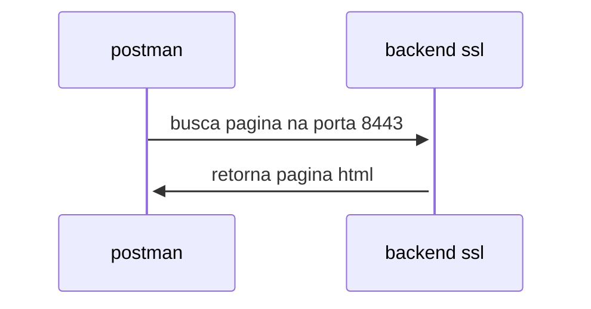

# POC DE MTLS


1 servidor chamado banana-server

senha bananafrita123
criar PKCS12 do 
 localhost para meu banana server


 2 cliente1 ovo
3 cliente2 queijo.


## Certificado Auto Assinado

A diferença entre certificados
Normalmente, quando você acessa um site seguro (como o do Porto Bank), o navegador confia na identidade do site porque o certificado SSL foi emitido por uma "Autoridade Certificadora" (CA), que é como um cartório digital. Essa autoridade verifica a identidade do site e assina o certificado, garantindo sua autenticidade. O navegador confia em todos os certificados emitidos por cartórios conhecidos.

Já no caso de um certificado autoassinado, você não recorre a nenhum cartório. Você mesmo gera o certificado e o assina. Por isso o nome "autoassinado". Ele tem todas as informações técnicas de um certificado normal (como chave, validade, domínio), mas não possui a garantia de um terceiro confiável.

Em resumo, o certificado SSL autoassinado é uma ferramenta útil para testes e ambientes de desenvolvimento, como o seu projeto de Pix no Porto Bank. Ele permite que você simule uma conexão segura, mas não deve ser utilizado em um ambiente real onde a confiança é fundamental.

---

## O COFRE

O que é o cofre?
No mundo da segurança digital, a criptografia é como uma fechadura. Para abrir essa fechadura, você precisa de uma chave. Para provar que você é quem diz ser (sua identidade), você precisa de um certificado digital, que é como uma identidade digital autenticada.

O keystore é o arquivo que guarda todas essas informações de forma segura. Ele tem uma senha própria, como um segredo para abrir o cofre.

Dentro dele, você pode ter:

Chaves privadas: São como as chaves de sua casa. Você as mantém em segredo para abrir a fechadura digital.

Certificados digitais: São como seu RG ou passaporte digital. Eles comprovam sua identidade para outras pessoas ou sistemas.

Como funciona na prática?
Quando você configura o SSL na sua aplicação Spring Boot, você está dizendo: "Ei, Spring Boot, para habilitar a conexão segura (HTTPS), as chaves e os certificados que você precisa estão nesse cofre (keystore.jks). A senha para abrir o cofre é 123456 e a chave que você vai usar lá dentro é a que tem o apelido springboot."

O Spring Boot, então, usa essas informações para criptografar as comunicações com os navegadores, garantindo que os dados (como a mensagem "oi mamae") viajem pela internet de forma segura, sem que ninguém consiga lê-los.

Em resumo, o keystore é o repositório seguro para chaves e certificados que sua aplicação usa para se identificar e criptografar dados. Ele é essencial para habilitar o SSL.

---
Senha: batatafrita123

```
$ keytool -genkeypair -alias certificado-app123 /
 -keyalg RSA -keysize 2048 /
  -storetype JKS -keystore src/main/resources/keystore-cofre-area53.jks -validity 3650
```

Como executar
```

$ mvn clean package
$ mvn clean spring-boot:run  
```


Como testar

$ open https://localhost:8443/olamundo


## DESENHO DE SOLUCAO




---

## Cofre no Padrao P12

 o formato JKS (Java KeyStore), que é um formato proprietário da Oracle, está sendo substituído pelo formato PKCS12. O PKCS12 é um padrão da indústria, o que significa que é mais amplamente utilizado e suportado por diferentes linguagens de programação e ferramentas, não apenas pelo ecossistema Java.

A recomendação é clara: migrar seu keystore JKS para o formato PKCS12.

```

keytool -importkeystore \
        -srckeystore src/main/resources/keystore-cofre-area53.jks \
        -destkeystore src/main/resources/keystore-cofre-area53.p12 \
        -deststoretype pkcs12
```


## IMPORTAR CERTIFICADO NO POSTMAN

$ keytool -exportcert -alias certificado-app123 -keystore src/main/resources/keystore-cofre-area53.p12 -storetype PKCS12 -file src/main/resources/fabao-local-server.crt

# Se o seu arquivo server.crt é binário, converta-o para PEM
$ openssl x509 -in src/main/resources/certificado-app123.crt -inform DER -out src/main/resources/certificado-app123.pem -outform PEM

# Primeiro, converta o keystore PKCS12 para um arquivo de certificado PEM (se necessário)
$ openssl pkcs12 -in src/main/resources/keystore-cofre-area53.p12 -nokeys -out src/main/resources/fabao-local-server.pem


## MTLS
Senha: ovofrito123

$ keytool -genkeypair -alias certificado-cliente-ovo -keyalg RSA -storetype PKCS12 -keystore cofre-client.p12 -validity 365 -dname "CN=cliente-ovo, OU=Fabio, O=Fabio, L=Campinas, ST=SP, C=BR"

$ keytool -exportcert -alias certificado-cliente-ovo -file client.cer -keystore cofre-client.p12 -storepass ovofrito123
$ keytool -exportcert -alias certificado-cliente-ovo -file client.cer -keystore cofre-client.p12 -storepass <senha-do-cliente>

2 Importe o certificado do cliente bob

$ keytool -importcert -alias certificado-cliente -file client.cer -keystore src/main/resources/keystore-cofre-area53.p12 -storepass batatafrita123
# Se seu keystore do servidor é o truststore
$ keytool -importcert -alias certificado-cliente -file client.cer -keystore src/main/resources/keystore-cofre-area53.p12 -storepass batatafrita123 -noprompt

$ keytool -importcert -alias cliente-confiavel-01 -file client.cer -keystore src/main/resources/keystore-cofre-area53.p12 -storepass batatafrita123

$ keytool -list -v -keystore src/main/resources/keystore-cofre-area53.p12 -storepass batatafrita123

## Topicos

1 o que sao os cofres
2 as chaves
3 os certificados
4 O padrao p12
5 postman e SSL Auto Assinado
6 postman configurando a chave
7 Exportando 
8 Certificados CA Validos
9 A seção de Client certificates da imagem serve para uma autenticação diferente: a autenticação mútua (mTLS). Nesse cenário, tanto o cliente (Postman) quanto o servidor (sua aplicação) se autenticam com certificados. Ou seja, o servidor só aceitaria a requisição se o Postman apresentasse um certificado de cliente que ele confiasse.

Como o seu objetivo é apenas fazer com que o Postman confie no seu servidor para que você possa testar sua API, a configuração correta é na seção CA certificates.

## Exportando o certificado publico do servidor
keytool -exportcert -alias certificado-app123 -file server.cer -keystore keystore-server.p12 -storepass batatafrita123
keytool -exportcert -alias certificado-cliente -file client.cer -keystore client-bob.p12 -storepass ovofrito123
keytool -exportcert -alias certificado-app123 -file server.cer -keystore keystore-cofre-area53.p12 -storepass batatafrita123

## SUBINDO DIRETO PARA A JVM
java -Djavax.net.ssl.trustStore=/Users/fabioalvaropereira/workspaces/tcc/olamundo/src/main/resources/keystore-cofre-area53.p12 \
     -Djavax.net.ssl.trustStorePassword=batatafrita123 \
     -Djavax.net.ssl.keyStore=/Users/fabioalvaropereira/workspaces/tcc/olamundo/src/main/resources/keystore-cofre-area53.p12 \
     -Djavax.net.ssl.keyStorePassword=batatafrita123 \
     -jar target/olaseguroprojeto-0.0.1-SNAPSHOT.jar


## LETS 

keytool -genkeypair -alias server_key -keyalg RSA -keysize 2048 -keystore keystore-cofre-area53.p12 -storepass batatafrita123 -dname "CN=localhost, OU=Dev, O=Porto Bank, L=São Paulo, ST=SP, C=BR" -keypass batatafrita123
keytool -certreq -alias server_key -keystore keystore-cofre-area53.p12 -storepass batatafrita123 -file server.csr

keytool -importcert -alias client_ca -file client.cer -keystore keystore-cofre-area53.p12 -storepass batatafrita123 -noprompt


Passo 3 : Assinar usando o CA: 
---


## SERVIDOR
## Criando o pedido de Assinatura CSR
openssl req -new -key banana-server.key -out banana-server.csr -subj "/C=BR/ST=SP/L=Sao Paulo/O=BananaServer/OU=Tech/CN=localhost"

## assinando com CA
openssl x509 -req -in banana-server.csr -CA ca1.crt -CAkey ca1.key -CAserial ca1.srl -out banana-server.crt -days 365

Passo 4: gerar P12
---
openssl pkcs12 -export -out banana-server.p12 -inkey banana-server.key -in banana-server.crt -certfile ca.crt -name banana-server -password pass:bananafrita123

Passo 5 : criar cofre java do servidor Feign Client
---
openssl pkcs12 -export -out banana-cofre.p12 -inkey banana-server.key -in banana-server.crt -certfile ca1.crt -name banana-server -password pass:bananafrita123

### Truste store
keytool -importcert -alias ca -file ca1.crt -keystore banana-server-truststore.p12 -storetype PKCS12 -storepass senha123 -noprompt


## CLIENTE ! OVO
### passos chave, certificado e cofre
openssl req -new -newkey rsa:2048 -nodes -keyout client1-ovo.key -out client1-ovo.csr -subj "/C=BR/ST=SP/L=Sao Paulo/O=Client1Ovo/OU=Clients/CN=client1-ovo"
openssl x509 -req -in client1-ovo.csr -CA ca1.crt -CAkey ca1.key -CAserial ca1.srl -out client1-ovo.crt -days 365
openssl pkcs12 -export -out client1-ovo-cofre.p12 -inkey client1-ovo.key -in client1-ovo.crt -certfile ca1.crt -name client1-ovo -password pass:ovofrito123
### Truste store
keytool -importcert -alias ca -file ca1.crt -keystore client1-ovo-truststore.p12 -storetype PKCS12 -storepass senha123 -noprompt


## CLIENTE 2 QUEIJO
### passos chave, certificado e cofre
openssl req -new -newkey rsa:2048 -nodes -keyout client2-queijo.key -out client2-queijo.csr -subj "/C=BR/ST=SP/L=Sao Paulo/O=Client2Queijo/OU=Clients/CN=client2-queijo"
openssl x509 -req -in client2-queijo.csr -CA ca1.crt -CAkey ca1.key -CAserial ca1.srl -out client2-queijo.crt -days 365
openssl pkcs12 -export -out client2-queijo-cofre.p12 -inkey client2-queijo.key -in client2-queijo.crt -certfile ca1.crt -name client2-queijo -password pass:queijo123
### Truste store
keytool -importcert -alias ca -file ca1.crt -keystore client2-queijo-truststore.p12 -storetype PKCS12 -storepass senha123 -noprompt