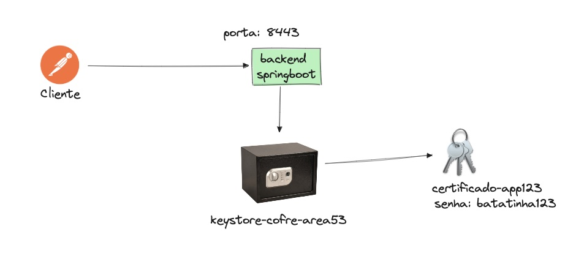

# Getting Started

## Certificado Auto Assinado

A diferença entre certificados
Normalmente, quando você acessa um site seguro (como o do Porto Bank), o navegador confia na identidade do site porque o certificado SSL foi emitido por uma "Autoridade Certificadora" (CA), que é como um cartório digital. Essa autoridade verifica a identidade do site e assina o certificado, garantindo sua autenticidade. O navegador confia em todos os certificados emitidos por cartórios conhecidos.

Já no caso de um certificado autoassinado, você não recorre a nenhum cartório. Você mesmo gera o certificado e o assina. Por isso o nome "autoassinado". Ele tem todas as informações técnicas de um certificado normal (como chave, validade, domínio), mas não possui a garantia de um terceiro confiável.

Em resumo, o certificado SSL autoassinado é uma ferramenta útil para testes e ambientes de desenvolvimento, como o seu projeto de Pix no Porto Bank. Ele permite que você simule uma conexão segura, mas não deve ser utilizado em um ambiente real onde a confiança é fundamental.

---

## O COFRE

O que é o cofre?
No mundo da segurança digital, a criptografia é como uma fechadura. Para abrir essa fechadura, você precisa de uma chave. Para provar que você é quem diz ser (sua identidade), você precisa de um certificado digital, que é como uma identidade digital autenticada.

O keystore é o arquivo que guarda todas essas informações de forma segura. Ele tem uma senha própria, como um segredo para abrir o cofre.

Dentro dele, você pode ter:

Chaves privadas: São como as chaves de sua casa. Você as mantém em segredo para abrir a fechadura digital.

Certificados digitais: São como seu RG ou passaporte digital. Eles comprovam sua identidade para outras pessoas ou sistemas.

Como funciona na prática?
Quando você configura o SSL na sua aplicação Spring Boot, você está dizendo: "Ei, Spring Boot, para habilitar a conexão segura (HTTPS), as chaves e os certificados que você precisa estão nesse cofre (keystore.jks). A senha para abrir o cofre é 123456 e a chave que você vai usar lá dentro é a que tem o apelido springboot."

O Spring Boot, então, usa essas informações para criptografar as comunicações com os navegadores, garantindo que os dados (como a mensagem "oi mamae") viajem pela internet de forma segura, sem que ninguém consiga lê-los.

Em resumo, o keystore é o repositório seguro para chaves e certificados que sua aplicação usa para se identificar e criptografar dados. Ele é essencial para habilitar o SSL.

---
Senha: batatafrita123

```
$ keytool -genkeypair -alias certificado-app123 /
 -keyalg RSA -keysize 2048 /
  -storetype JKS -keystore src/main/resources/keystore-cofre-area53.jks -validity 3650
```

Como executar
```

$ mvn clean package
$ mvn clean spring-boot:run  
```


Como testar

$ open https://localhost:8443/olamundo


## DESENHO DE SOLUCAO





---

## Cofre no Padrao P12

 o formato JKS (Java KeyStore), que é um formato proprietário da Oracle, está sendo substituído pelo formato PKCS12. O PKCS12 é um padrão da indústria, o que significa que é mais amplamente utilizado e suportado por diferentes linguagens de programação e ferramentas, não apenas pelo ecossistema Java.

A recomendação é clara: migrar seu keystore JKS para o formato PKCS12.

```

keytool -importkeystore \
        -srckeystore src/main/resources/keystore-cofre-area53.jks \
        -destkeystore src/main/resources/keystore-cofre-area53.p12 \
        -deststoretype pkcs12
```


## Topicos

1 o que sao os cofres
2 as chaves
3 os certificados
4 O padrao p12
4 postman e SSL Auto Assinado
4 postman configurando a chave
6 Certificados CA Validos